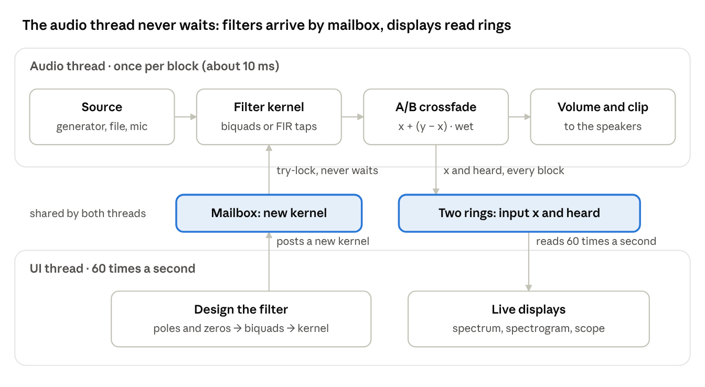

# Filter Lab DSP Study Guide

By Rivija Pesara · 7 October 2026 · companion to the Filter Lab app in this repository

## How to use this guide

Every algorithm in Filter Lab is rewritten here in plain Python and NumPy, and each one has been checked against SciPy, so you can run what you read. The GUI is left out. The guide follows the numbers: how they are made, filtered, played and measured.

You need Python 3.10 or newer with NumPy and SciPy:

```bash
pip install numpy scipy
```

The companion code lives in `FilterLab/study/`, next to the app:

| File | What it contains | Swift files it mirrors |
| --- | --- | --- |
| `fl_design.py` | Analog prototypes, band transforms, bilinear transform, FIR window method, polynomial roots, biquad pairing, responses, pole–zero presets | `DSP/*.swift` |
| `fl_realtime.py` | Biquad and FIR loops, test-signal generators, ring buffer, lock-free hand-off, the output callback, microphone resampler, spectrum, spectrogram, scope trigger | `Audio/*.swift`, `UI/LiveViews.swift` |
| `check_all.py` | 13 checks of the two files above against SciPy and NumPy | none |

Run the checks first. They take about five seconds:

```bash
cd FilterLab/study
python3 check_all.py
```

The last line should read `13/13 checks passed`. Every code block in this guide comes from those two files, so `import fl_design as d` and `import fl_realtime as rt` let you try it yourself.

Notation used throughout:

- fs is the sample rate in samples per second (48,000 unless stated).
- n counts samples, so x\[n\] is the n-th input sample and y\[n\] the n-th output sample.
- ω = 2πf/fs is frequency in radians per sample. 0 Hz is ω = 0 and fs/2 is ω = π.
- z⁻¹ means a delay of one sample.

Sections 1–3 cover the basics. Sections 4–9 are filter design, section 10 is measurement, and sections 11–13 cover the real-time engine, the displays and exports.

## 1. The big picture: how audio flows

Audio moves through Filter Lab in small blocks. About every 10 ms the speakers ask for the next block of samples, and one function builds it from source to filter to speakers. Everything else, including the plots, the design maths and the buttons, runs on a separate, slower thread.



Sound moves left to right on the audio thread. The UI thread only ever posts to the mailbox or reads the rings, so it can never hold the audio up.

There are two threads with very different rules:

| Thread | Runs | Deadline | Does |
| --- | --- | --- | --- |
| Audio (real-time) | once per block, about 94 times a second at 48 kHz with 512-sample blocks | must finish in about 10.7 ms, every time | make the source, filter it, crossfade, set the volume, write to the rings |
| UI (main) | 60 times a second, plus whenever you touch a control | none, a slow frame just looks jerky | design filters, find roots, run FFTs, draw |

One audio block goes through these steps:

1. **Source.** Make n samples of input x: a generator (sine, sweep, noise and so on), a pre-rendered loop (the music, or a file you opened), or samples from the microphone ring.
2. **Filter.** Run x through the current filter kernel to get y. A kernel is a biquad cascade (IIR) or a tap list (FIR).
3. **A/B crossfade.** heard = x + (y − x)·wet, where wet glides between 0 (Original) and 1 (Filtered) over 10 ms.
4. **Volume and clipping.** out = heard × gain, limited to ±1. The gain also glides, so Listen never clicks.
5. **Speakers.** The system mixer converts the lab's rate (8–48 kHz) to the device's own rate.
6. **Rings.** Copy x into the input ring and heard into the output ring. The UI reads both to draw the spectrum, spectrogram and scope.

The design path runs the other way. When you move a slider, the UI thread recomputes the poles and zeros, groups them into biquads and builds a new kernel. It then hands the kernel to the audio thread through a lock-free mailbox, so the audio thread never waits (section 11).

Here is one block of the audio path in Python, with a sine source and a 1 kHz low-pass:

```python
import fl_design as d, fl_realtime as rt

fs = 48000
sos = d.zpk_to_sos(*d.design_iir("lowpass", "butterworth", 4, 1000, 0, 0, 0, fs))
kernel = rt.BiquadCascade(sos)                # what the UI hands over
gen = rt.Generator(fs)
in_ring, out_ring = rt.SampleRing(1 << 18), rt.SampleRing(1 << 18)
wet, gain = 1.0, 0.0

for block in range(100):                      # 100 blocks of 512 = about 1 second
    x = gen.sine(512, 440)                    # 1. source
    out, wet, gain = rt.render_block(         # 2-6. filter, crossfade, volume, rings
        x, kernel, wet, gain, filter_on=True, listen_volume=0.7,
        fs=fs, in_ring=in_ring, out_ring=out_ring)
    # `out` is what the speakers would play
```

## 2. Signals as numbers

A digital signal is a list of numbers taken fs times a second, each normally between −1 and +1. Filter Lab uses fs = 48,000 by default, so nothing above fs/2 = 24 kHz (the Nyquist frequency) can exist inside it. A tone above Nyquist folds back to a lower frequency, which is called aliasing:

```python
import numpy as np
fs = 48000
n = np.arange(16)
a = np.sin(2 * np.pi * 30000 * n / fs)   # 30 kHz: above Nyquist
b = np.sin(2 * np.pi * 18000 * n / fs)   # 18 kHz
print(np.allclose(a, -b))                # True: the samples cannot tell them apart
```

You can choose fs = 8, 16, 22.05, 32, 44.1 or 48 kHz in the app. The whole lab, including sources, filters and displays, then runs at that rate.

### Sine: a phase accumulator

The sine is not computed as sin(2πft). Instead, a phase counter in cycles moves forward by f/fs every sample and wraps at 1. This keeps the wave continuous when you drag the frequency, and the phase never grows large enough to lose precision. The frequency itself glides towards the slider value with a 20 ms one-pole smoother, so dragging makes no zipper noise:

```python
glide = 1 - math.exp(-1 / (0.02 * fs))          # 20 ms smoothing constant
for i in range(n):
    self.freq += (target_hz - self.freq) * glide  # one-pole low-pass on the frequency
    self.phase = (self.phase + self.freq / fs) % 1.0
    out[i] = 0.35 * math.sin(2 * math.pi * self.phase)
```

### Square wave: PolyBLEP against aliasing

An ideal square wave has harmonics at f, 3f, 5f and so on forever. Sampled naively, the ones above Nyquist alias into a gritty mess. PolyBLEP (polynomial band-limited step) replaces the two samples around each jump with a small polynomial curve that rounds the step off. For a 3.11 kHz square, measured with `fl_realtime.py`, the aliased energy is 14 dB below the real harmonics for the naive wave and 39 dB below with PolyBLEP.

```python
def poly_blep(t, dt):            # t = phase in cycles, dt = f / fs
    if t < dt:                   # just after a jump
        x = t / dt
        return x + x - x * x - 1
    if t > 1 - dt:               # just before a jump
        x = (t - 1) / dt
        return x * x + x + x + 1
    return 0.0

v = 1.0 if phase < 0.5 else -1.0
v += poly_blep(phase, dt)                # smooth the rising edge
v -= poly_blep((phase + 0.5) % 1.0, dt)  # smooth the falling edge
```

### The other test signals

| Source | How it is made | Why it is useful |
| --- | --- | --- |
| Frequency sweep | Log chirp from 20 Hz to 0.45·fs over 8 s, then repeat; the phase is integrated just like the sine | Draws the filter's magnitude response on the spectrogram |
| White noise | xorshift64\* random numbers, uniform in \[−0.3, 0.3\], RMS 0.173 | Equal power at every frequency, so the output spectrum takes the shape of \|H\| |
| Pink noise | White noise through Paul Kellet's sum of six one-pole low-passes, about −3 dB per octave | Sounds more natural and matches music's spectral tilt |
| Clicks | One sample of 0.8 every 0.5 s | Each click excites the filter, so you hear and see its impulse response |
| Music loop | Synthesised once at start-up (kick, snare, hats, bass, pad and arpeggio), 8.6 s, peak 0.6 | Energy from 40 Hz to above 15 kHz, so every filter has something to remove |
| Music + 50 Hz hum | The loop plus 50 Hz hum and harmonics to 250 Hz | The target for the mains-hum notch filter |
| Audio file | Decoded, mixed to mono, normalised to 0.7 peak and resampled to fs (section 11) | Your own material |
| Microphone | Live input, resampled to fs with drift control (section 11) | Your voice |

The log sweep's instantaneous frequency is:

```math
f(t) = f_0 \left(\frac{f_1}{f_0}\right)^{t/T}, \qquad \phi[n+1] = \phi[n] + \frac{f(t_n)}{f_s}
```

It spends equal time in every octave, which matches the log frequency axis of the plots.

## 3. The z-plane: poles, zeros and the frequency response

Every filter in the app is a linear recurrence. Its frequency response is its transfer function H(z) evaluated around the unit circle. A filter computes each output from recent inputs and outputs:

```math
y[n] = \sum_{k=0}^{M} b_k\, x[n-k] \;-\; \sum_{k=1}^{N} a_k\, y[n-k]
```

Taking the z-transform (z⁻¹ = one sample of delay) turns this into a ratio of polynomials. Factoring them gives the zeros zᵢ and poles pᵢ:

```math
H(z) = \frac{b_0 + b_1 z^{-1} + \dots + b_M z^{-M}}{1 + a_1 z^{-1} + \dots + a_N z^{-N}} = k\,\frac{(z - z_1)(z - z_2)\cdots}{(z - p_1)(z - p_2)\cdots}
```

The design code works in this zeros, poles and gain form, written (z, p, k) as in SciPy. A real sinusoid of frequency f corresponds to the point z = e^{jω} on the unit circle, with ω = 2πf/fs. So 0 Hz sits at z = 1, Nyquist sits at z = −1, and frequencies in between run anticlockwise along the top half.

### The geometric view

On the circle every factor (e^{jω} − zᵢ) is a vector from a zero to the point. The gain at that frequency is therefore a ratio of distances:

```math
|H(e^{j\omega})| = k \cdot \frac{\prod_i |e^{j\omega} - z_i|}{\prod_i |e^{j\omega} - p_i|}
```

This is exactly what the app's hover lines show. In Python:

```python
import numpy as np
import fl_design as d

fs = 48000
z, p, k = d.design_iir("lowpass", "butterworth", 2, 1000, 0, 0, 0, fs)
point = np.exp(2j * np.pi * 1000 / fs)              # e^{jω} for f = 1 kHz
by_distance = k * np.prod(np.abs(point - z)) / np.prod(np.abs(point - p))
print(20 * np.log10(by_distance))                   # -3.0103 dB: the Butterworth cutoff
```

This 2nd-order filter has two zeros at z = −1 and two poles at 0.908 ± 0.084j. Three rules follow from the distances:

- A zero near the circle makes a dip at its angle. A zero exactly on the circle makes a perfect notch (gain 0).
- A pole near the circle makes a peak at its angle. The closer it gets, the sharper and taller the peak.
- A pole or zero at the origin is the same distance (1) from every point on the circle, so it changes only the delay, never the gain.

### Stability

Each pole p adds a term proportional to pⁿ to the impulse response, so only its distance from the origin decides what happens:

| \|p\| | pⁿ at n = 10, 50, 100 | Behaviour |
| --- | --- | --- |
| 0.9 | 0.349, 0.005, 0.000 | Decays: stable |
| 1.0 | 1, 1, 1 | Rings forever: marginally stable |
| 1.1 | 2.59, 117, 13,781 | Grows without limit: unstable |

A causal filter is stable exactly when every pole is strictly inside the unit circle. A pole at radius r rings for roughly 1/(1 − r) samples. At r = 0.995 that is 200 samples, or 4.2 ms at 48 kHz.

The z-plane's shaded |H| map adds log|z − zᵢ| for every zero and subtracts it for every pole, at each pixel. Poles and zeros at the origin are left out because they only add delay. For FIR filters the map is switched off: their N − 1 origin poles would swamp the picture.

## 4. Designing IIR filters

Filter Lab designs IIR filters in the same three steps as SciPy's `signal.butter` and MATLAB's `butter()`. It starts with an analog prototype with its cutoff at 1 rad/s, moves it to the band you want, then maps it to digital with the bilinear transform. The results match SciPy to about 12 significant digits.

```python
def design_iir(band, family, order, f1, f2, rp, rs, fs):
    z, p, k = PROTOTYPES[family](order, rp, rs)               # step 1: analog prototype
    if band == "lowpass":
        z, p, k = lp2lp(z, p, k, prewarp(f1, fs))              # step 2: move to the band
    elif band == "highpass":
        z, p, k = lp2hp(z, p, k, prewarp(f1, fs))
    else:
        w1, w2 = prewarp(f1, fs), prewarp(f2, fs)
        transform = lp2bp if band == "bandpass" else lp2bs
        z, p, k = transform(z, p, k, math.sqrt(w1 * w2), w2 - w1)
    return bilinear(z, p, k, fs)                                # step 3: s-plane -> z-plane
```

### Step 1: the analog prototypes

Each family is a recipe for where to put the poles (and sometimes zeros) of a low-pass with its cutoff at 1 rad/s:

| Family | Poles and zeros | What the cutoff means | Trade-off |
| --- | --- | --- | --- |
| Butterworth | n poles evenly spaced on the left half of the unit circle | −3 dB point | Maximally flat passband; roll-off approaches −20n dB per decade |
| Chebyshev I | Butterworth's angles, squashed onto an ellipse | End of the passband ripple (Rp dB) | Steeper than Butterworth at the same order, but the passband ripples |
| Chebyshev II | Poles from an inverted ellipse, zeros on the imaginary axis | Start of the stopband (Rs dB down) | Flat passband; the stopband ripples with notches |
| Elliptic | Poles and zeros from Jacobi elliptic functions | End of the passband ripple | Steepest transition for a given order; ripple in both bands |
| Bessel | Roots of the reverse Bessel polynomial | Phase midpoint | Nearly constant group delay, so waveforms keep their shape; gentle roll-off |

The first two are a few lines each:

```python
def buttap(n):
    m = np.arange(-n + 1, n, 2)                    # -n+1, -n+3, ..., n-1
    p = -np.exp(1j * np.pi * m / (2 * n))          # poles on the unit circle, left half
    return np.array([]), p, 1.0

def cheb1ap(n, rp):
    eps = math.sqrt(10 ** (0.1 * rp) - 1)          # ripple factor
    mu = math.asinh(1 / eps) / n
    m = np.arange(-n + 1, n, 2)
    p = -np.sinh(mu + 1j * np.pi * m / (2 * n))    # poles on an ellipse
    k = np.prod(-p).real
    if n % 2 == 0:                                 # even order: DC sits at the ripple's bottom
        k /= math.sqrt(1 + eps * eps)
    return np.array([]), p, k
```

For n = 4, `buttap` gives poles at −0.383 ± 0.924j and −0.924 ± 0.383j: four points 45° apart on the circle. The elliptic prototype needs more maths. It uses the complete elliptic integral K(m) and the Jacobi functions sn, cn and dn, computed with the arithmetic–geometric mean. A 'degree equation' then picks the modulus that meets both ripple specs at order n. These are `agm`, `ellipk`, `ellipj`, `ellipdeg`, `arc_jac_sn` and `ellipap` in `fl_design.py`. Bessel needs the roots of a polynomial, found with the method in section 8.

### Step 2: moving the prototype to your band

A change of variable in s moves the cutoff from 1 rad/s to ω₀ and changes the filter type:

| Target | Substitution | What happens to the roots |
| --- | --- | --- |
| Low-pass at ω₀ | s → s/ω₀ | Every root is scaled by ω₀ |
| High-pass at ω₀ | s → ω₀/s | Every root r becomes ω₀/r; new zeros appear at s = 0 |
| Band-pass, centre ω₀, width B | s → (s² + ω₀²)/(B·s) | Every root splits into two, so the order doubles |
| Band-stop | s → B·s/(s² + ω₀²) | Splits too; zeros land at ±jω₀ |

This is why the app's Order slider says ×2 for band filters: order 4 gives 8 poles. For bands, ω₀ = √(ω₁ω₂) is the geometric centre and B = ω₂ − ω₁.

### Step 3: the bilinear transform

The analog filter is mapped to digital by substituting:

```math
s = 2 f_s \, \frac{z - 1}{z + 1} \quad\Longleftrightarrow\quad z = \frac{2 f_s + s}{2 f_s - s}
```

This maps the whole imaginary axis (every analog frequency) onto the unit circle exactly once, so there is no aliasing. It also maps the left half-plane inside the circle, so a stable analog filter always gives a stable digital one. Analog frequency Ω = ∞ lands on z = −1, which is why a Butterworth low-pass has all n of its zeros stacked at z = −1.

The price is that frequencies get squeezed: analog Ω and digital ω are related by Ω = 2fs·tan(ω/2). So before step 2 the cutoff is pre-warped to the analog frequency that will land exactly on fc:

```python
def prewarp(f, fs):
    return 2 * fs * math.tan(math.pi * f / fs)    # 1 kHz at 48 kHz -> 6292.2 rad/s (not 2π·1000 = 6283.2)

def bilinear(z, p, k, fs):
    degree = len(p) - len(z)
    fs2 = 2 * fs
    z_d = np.concatenate([(fs2 + z) / (fs2 - z), -np.ones(degree)])   # extra zeros at z = -1
    p_d = (fs2 + p) / (fs2 - p)
    k_d = k * (np.prod(fs2 - z) / np.prod(fs2 - p)).real
    return z_d, p_d, k_d
```

Check it against SciPy yourself:

```python
from scipy import signal
z, p, k = d.design_iir("bandpass", "elliptic", 4, 500, 3000, 1, 60, 48000)
zs, ps, ks = signal.ellip(4, 1, 60, [500, 3000], "bandpass", fs=48000, output="zpk")
print(np.allclose(np.sort_complex(p), np.sort_complex(ps)),
      np.allclose(np.sort_complex(z), np.sort_complex(zs)), np.isclose(k, ks))   # True True True
```

## 5. Second-order sections: splitting the filter into biquads

The app never multiplies all the poles into one big polynomial. It groups them into second-order sections, or biquads, each holding at most two poles and two zeros. A high-order polynomial is so sensitive to rounding that its roots move, sometimes outside the unit circle.

Here is the failure in four lines. This 16-pole elliptic band-pass (500–700 Hz) is perfectly stable, but its denominator expanded into one polynomial is not:

```python
z, p, k = d.design_iir("bandpass", "elliptic", 8, 500, 700, 0.5, 80, 48000)   # 16 poles
a = np.real(np.poly(p))                  # multiply all 16 poles into one polynomial
print(np.max(np.abs(p)))                 # 0.9997: just inside the circle
print(np.max(np.abs(np.roots(a))))       # 1.169: rounding pushed a pole outside!
```

Run as a single polynomial, this filter's impulse response grows until it becomes NaN. Its gain at 600 Hz comes out as −98.5 dB instead of the correct −0.37 dB. Split into 8 biquads, it behaves perfectly.

### One biquad

A complex pole pair p, p\* multiplies out to a quadratic with real coefficients, and so does a zero pair:

```math
(1 - p z^{-1})(1 - p^{*} z^{-1}) = 1 - 2\,\mathrm{Re}(p)\, z^{-1} + |p|^2 z^{-2}
```

So each section is five numbers: b₀, b₁, b₂ on top and a₁, a₂ underneath (a₀ = 1). For a pole at radius 0.95 and angle 0.3 rad, a₁ = −2·0.95·cos 0.3 = −1.8151 and a₂ = 0.95² = 0.9025.

### How poles and zeros are paired

`zpk_to_sos` repeats these steps until every pole is used:

1. Pick the remaining pole (or pole pair) closest to the unit circle. It makes the biggest peak, so it is handled first.
2. Give it the zero pair (or two real zeros) nearest to it. A nearby zero partly cancels the pole's peak, which keeps the numbers inside each section small.
3. Lone real poles are paired with each other. Any leftover zeros become sections with no poles.
4. Finally, multiply the overall gain k into the first section's b coefficients.

```python
def section(zeros, poles):
    b = list(np.real(np.poly(zeros))) if zeros else [1.0]   # (z - z1)(z - z2) -> [1, b1, b2]
    a = list(np.real(np.poly(poles))) if poles else [1.0]
    b += [0.0] * (3 - len(b))                               # pad first-order sections
    a += [0.0] * (3 - len(a))
    return [b[0], b[1], b[2], 1.0, a[1], a[2]]              # SciPy's sos row layout
```

The rows use SciPy's layout, \[b0, b1, b2, a0, a1, a2\], so `scipy.signal.sosfilt(sos, x)` runs them unchanged. In the app's Theory panel each row is drawn as a stacked fraction, with b₀ pulled out in front as a gain. The 16-pole filter above is 8 rows like this one:

```python
[9.9e-05, -1.98e-04, 9.9e-05, 1.0, -1.995129, 0.999404]   # poles at |p| = 0.9997, zeros at z = 1
```

SciPy's own `zpk2sos` uses similar nearest-pairing rules, but it can order the sections differently. The overall response is identical either way.

## 6. Running a filter in real time

Each biquad runs in transposed direct form II (DF2T). That costs 5 multiplications per sample and keeps just two numbers of memory, s₁ and s₂. The memory is carried from block to block, so a stream cut into 512-sample blocks filters exactly as if it were one long array.

For each input sample x, one section computes:

```math
\begin{aligned}
y &= b_0 x + s_1 \\
s_1 &\leftarrow b_1 x - a_1 y + s_2 \\
s_2 &\leftarrow b_2 x - a_2 y
\end{aligned}
```

The section's output y becomes the next section's input. A 4th-order Butterworth is 2 sections, so 10 multiplications per sample, or 480,000 per second at 48 kHz. That is trivial for a CPU.

```python
class BiquadCascade:
    def __init__(self, sos):
        self.sos = np.asarray(sos, float)
        self.state = np.zeros((len(self.sos), 2))       # s1, s2 for each section

    def process(self, x):
        y = np.asarray(x, float).copy()
        for i, (b0, b1, b2, _, a1, a2) in enumerate(self.sos):
            s1, s2 = self.state[i]
            for n in range(len(y)):
                xn = y[n]
                yn = b0 * xn + s1
                s1 = b1 * xn - a1 * yn + s2
                s2 = b2 * xn - a2 * yn
                y[n] = yn
            self.state[i] = s1, s2                      # remember for the next block
        if not np.all(np.isfinite(y)) or np.max(np.abs(y), initial=0) > 1e4:
            self.state[:] = 0                           # runaway: reset and stay silent
            return np.zeros_like(y), False
        return y, True
```

The state really matters. Filtering 6,000 noise samples in 512-sample blocks matches `scipy.signal.sosfilt` to 1e-15. Throw the state away between blocks and the output is off by up to 0.06, and you would hear a click every 10.7 ms.

```python
x = np.random.default_rng(0).standard_normal(6000) * 0.2
cascade = rt.BiquadCascade(sos)
y = np.concatenate([cascade.process(x[i:i + 512])[0] for i in range(0, len(x), 512)])
print(np.max(np.abs(y - signal.sosfilt(sos, x))))   # 1e-15: the blocks join seamlessly
```

### Details that make it sound clean

- **Double precision.** Audio arrives as 32-bit floats, but the filter runs in 64-bit doubles. Poles very close to the circle, like the hum notches at r = 0.99974, need that precision.
- **Keeping state across redesigns.** When you drag a slider, the new kernel copies s₁ and s₂ from the old one if it has the same number of sections (`adopt_state`). This avoids a click on every movement.
- **Instability.** A design with any pole at |p| ≥ 1 is never run: its output is silence and the app shows a warning. If a stable filter's output still exceeds 10,000 or becomes NaN, the state is reset and the block is muted.
- **Denormals.** As a filter rings down, its state keeps shrinking towards zero. Eventually it reaches denormal numbers (below about 1e-308), which are very slow on many CPUs. So the Swift code sets any state below 1e-200 to exactly 0, well before that point.
- **Why DF2T?** It needs only 2 memory values per section, against 4 for direct form I. It also behaves well in floating point. SciPy's `sosfilt` uses the same structure.

## 7. FIR filters: the window method

An FIR filter is a weighted sum of the last N inputs, with no feedback, so it is always stable. Filter Lab designs the N weights (taps) with the window method, exactly like `scipy.signal.firwin` and MATLAB's `fir1`. The taps match SciPy to 1e-16.

```math
y[n] = \sum_{k=0}^{N-1} h[k]\, x[n-k]
```

### From an ideal filter to real taps

The ideal low-pass with cutoff fc (gain 1 below, 0 above) has an impulse response that is a sinc stretching forever in both directions:

```math
h_{\text{ideal}}[m] = \frac{2 f_c}{f_s}\,\mathrm{sinc}\!\left(\frac{2 f_c}{f_s}\, m\right), \qquad \mathrm{sinc}(x) = \frac{\sin \pi x}{\pi x}
```

The window method takes three steps:

1. Keep N samples of it, centred on m = 0. A band-pass is the difference of two low-pass sincs, and a band-stop is a low-pass plus a high-pass.
2. Multiply by a smooth window w\[m\] that tapers to the edges.
3. Scale the taps so the gain is exactly 0 dB at the centre of the first passband (DC for a low-pass).

```python
def design_fir(band, taps, f1, f2, window, beta, fs):
    c1, c2 = f1 / (fs / 2), f2 / (fs / 2)               # cutoffs as fractions of Nyquist
    bands = {"lowpass": [(0, c1)], "highpass": [(c1, 1)],
             "bandpass": [(c1, c2)], "bandstop": [(0, c1), (c2, 1)]}[band]
    m = np.arange(taps) - (taps - 1) / 2                # time index centred on 0
    h = sum(right * np.sinc(right * m) - left * np.sinc(left * m) for left, right in bands)
    h = h * make_window(window, taps, beta)
    left, right = bands[0]
    f0 = 0 if left == 0 else (1 if right == 1 else (left + right) / 2)
    return h / np.sum(h * np.cos(np.pi * m * f0))        # 0 dB at the passband centre
```

### Windows: sharpness against stopband depth

Cutting the sinc off abruptly (a rectangular window) leaves Gibbs ripples. Smoother windows push the stopband further down but widen the transition band:

| Window | w\[m\] for m = 0 … N−1, x = m/(N−1) | Typical stopband | Transition width |
| --- | --- | --- | --- |
| Rectangular | 1 | −21 dB | Narrowest |
| Hann | 0.5 − 0.5 cos 2πx | −44 dB | Medium |
| Hamming | 0.54 − 0.46 cos 2πx | −53 dB | Medium |
| Blackman | 0.42 − 0.5 cos 2πx + 0.08 cos 4πx | −74 dB | Wide |
| Kaiser (β) | I₀(β√(1 − (2x−1)²)) / I₀(β) | Chosen by β: about −50 dB at β = 4.5, −90 dB at β = 8.9 | Grows with β |

For all windows the transition width shrinks roughly as 1/N: double the taps and the edge is twice as sharp. Note that the cutoff of a window-method filter is its −6 dB point, not −3 dB. A 63-tap Hamming low-pass at 2 kHz measures −6.03 dB at 2 kHz.

### Linear phase

The taps are symmetric, h\[k\] = h\[N−1−k\]. A symmetric filter delays every frequency by exactly (N−1)/2 samples, so a waveform's shape survives intact, just later:

```python
h = d.design_fir("lowpass", 63, 2000, 0, "hamming", 0, 48000)
print(np.allclose(h, h[::-1]))                            # True: symmetric
print(d.poly_group_delay(h, np.array([0.1, 0.5, 1.0])))   # [31. 31. 31.] samples everywhere
```

High-pass and band-stop FIRs need an odd N. An even-length symmetric filter always has a zero at z = −1 (Nyquist), which a high-pass cannot tolerate. The app quietly adds one tap.

### Running an FIR: the doubled delay line

The app keeps the last N inputs in a circular buffer that is twice as long, and writes every sample into both halves. Then the newest N samples always sit in one contiguous slice, and the sum is a single dot product (`vDSP_dotprD` in Swift, `@` in NumPy):

```python
self.pos = self.n - 1 if self.pos == 0 else self.pos - 1   # move the write head back one
self.delay[self.pos] = v                                   # write the sample twice...
self.delay[self.pos + self.n] = v
y = self.h @ self.delay[self.pos:self.pos + self.n]        # ...so this slice never wraps
```

The cost is N multiplications per sample: 101 for a 101-tap FIR, against 10 for a 4th-order IIR. FIR buys linear phase and guaranteed stability with computation and delay.

## 8. Finding the zeros: the Aberth method

To draw an FIR filter's zeros, the app needs every root of its tap polynomial at once: 254 of them for 255 taps. It uses the Aberth–Ehrlich method, which refines all the root estimates together. It takes about 10 ms in Swift and agrees with `numpy.roots` to about 1e-14.

The zeros of H(z) = Σ h\[k\] z⁻ᵏ are the roots of the ordinary polynomial h\[0\]zᴺ⁻¹ + h\[1\]zᴺ⁻² + … + h\[N−1\]. So the taps already are the polynomial's coefficients, highest power first.

### The update rule

Newton's method corrects one guess with the ratio p(z)/p′(z). Aberth adds a term that pushes each guess away from all the others, so no two guesses chase the same root:

```math
z_k \leftarrow z_k - \frac{r_k}{1 - r_k \sum_{j \ne k} \frac{1}{z_k - z_j}}, \qquad r_k = \frac{p(z_k)}{p'(z_k)}
```

The guesses start evenly spaced on a circle whose radius is the geometric mean of the root sizes, |cₙ/c₀|^(1/n). The loop stops when no guess moves by more than 1e-14.

```python
radius = max(1e-6, abs(c[-1]) ** (1 / n))          # c is the monic polynomial
x = radius * np.exp(1j * (2 * np.pi * np.arange(n) / n + 0.4))
for _ in range(600):
    biggest = 0.0
    for i in range(n):
        ratio = newton_ratio(x[i])                          # p/p' (see below)
        repel = np.sum(1 / (x[i] - np.delete(x, i)))        # push away from the other guesses
        step = ratio / (1 - ratio * repel)
        x[i] -= step
        biggest = max(biggest, abs(step) / max(1, abs(x[i])))
    if biggest < 1e-14:
        break
```

### The overflow bug, and its fix

The first version of the app broke at 255 taps. A guess that strayed to |z| = 45 made p(z) contain 45²⁵⁴, about 10⁴²⁰, which overflows a double to infinity. The fix evaluates the reversed polynomial q(w) = wⁿ p(1/w) at w = 1/z whenever |z| > 1, so the powers only shrink:

```math
\frac{p(z)}{p'(z)} = \frac{z}{\,n - w\, q'(w)/q(w)\,}, \qquad w = \frac{1}{z}
```

```python
def newton_ratio(x):
    if abs(x) <= 1:
        return np.polyval(c, x) / np.polyval(dc, x)        # ordinary Newton ratio
    w = 1 / x                                              # |w| < 1: no overflow possible
    return x / (n - w * np.polyval(rdc, w) / np.polyval(rc, w))
```

After the loop, `pair_conjugates` cleans up rounding. It snaps nearly-real roots onto the real axis and makes each complex root's partner its exact conjugate, because a real filter's roots must come in conjugate pairs.

### What the zeros of a linear-phase FIR look like

Symmetric taps force the zeros into groups: if z is a zero, so are 1/z, z\* and 1/z\*. In a 101-tap Hamming low-pass at 1 kHz, 96 of the 100 zeros sit exactly on the unit circle, spread through the stopband where they carve notches. The other 4 are real, in two reciprocal pairs on the positive real axis (0.62 with 1.61, and 0.89 with 1.12), and they shape the passband.

```python
h = d.design_fir("lowpass", 101, 1000, 0, "hamming", 0, 48000)
roots = d.pair_conjugates(d.polyroots(h))
print(len(roots))                                                      # 100
print(np.max(np.abs(np.sort_complex(roots) - np.sort_complex(np.roots(h)))))   # about 6e-14
print(np.sum(np.abs(np.abs(roots) - 1) < 1e-6))                        # 96 on the unit circle
```

The same routine finds the Bessel prototype's poles (section 4), as roots of the reverse Bessel polynomial. In the app the FIR roots are found on a background thread, and only the newest design's job is kept, so dragging the Taps slider never stalls the screen.

## 9. Hand-placed poles and zeros

In Pole–Zero mode you place the roots yourself. The app then does two things automatically: it adds roots at the origin so the filter is causal, and it scales the gain so the loudest frequency is exactly 0 dB.

Each item you place is either a single real root or a conjugate pair, stored as one point in the upper half-plane. A pair at re^{jθ} sits at frequency f = θ·fs/(2π).

### Causality and gain

If there are more zeros than poles, H(z) contains positive powers of z. Running it would need samples from the future. Adding poles at z = 0 fixes that, because z⁻¹ is just a one-sample delay and changes no gains. The reverse case gets zeros at the origin. Then the gain k is set so the peak of |H| on the unit circle is 1:

```python
def pole_zero_filter(zeros, poles, fs):
    zeros, poles = list(zeros), list(poles)
    if len(zeros) > len(poles):
        poles += [0j] * (len(zeros) - len(poles))       # balancing poles at the origin
    elif len(poles) > len(zeros):
        zeros += [0j] * (len(poles) - len(zeros))
    z, p = np.array(zeros, complex), np.array(poles, complex)
    sos = zpk_to_sos(z, p, 1.0)
    f = fs / 2 * (np.arange(4097) / 4096) ** 2           # dense near DC, where hum notches live
    f = np.concatenate([f, np.abs(np.angle(p[np.abs(p) > 0.5])) / (2 * np.pi) * fs])   # + each pole's peak
    peak = np.max(np.abs(sos_response(sos, f, fs)))
    k = 1 / peak if np.isfinite(peak) and peak > 1e-12 else 1.0
    return z, p, k, zpk_to_sos(z, p, k)
```

The frequency grid is squared so that it is dense near 0 Hz. A plain linear grid would step right over a 4 Hz-wide resonance at 50 Hz. The exact angle of every pole is added too, so even the sharpest peak is caught.

### The presets

| Preset | Where the roots go | Result (checked with `fl_design.py` at 48 kHz) |
| --- | --- | --- |
| Resonator | Pole pair at r = 0.995, 1 kHz; zeros at z = 1 and z = −1 | Peak exactly 0 dB at 1 kHz with k = 0.00499; rings for about 200 samples |
| Notch | Zero pair on the circle at 1 kHz; pole pair at r = 0.97, same angle | Total silence at 1 kHz; the nearby poles keep the notch narrow |
| Mains hum remover | Zero pairs on the circle at 50, 100, 150, 200, 250 Hz; poles just inside at r = 1 − 4π/fs | Each notch is 4.0 Hz wide at −3 dB; 1 kHz passes at −0.0002 dB |
| Comb | 16 poles at 0.8^(1/16)·e^{j2πk/16}, so y\[n\] = x\[n\] + 0.8·y\[n−16\] | Peaks of 0 dB every 3 kHz (fs/16), dips of −19.1 dB between them |
| All-pass | Pole at 0.9∠θ, zero at (1/0.9)∠θ (the mirror image 1/p\*) | \|H\| = 1.000000 at every frequency; only the phase changes |
| Moving average (8) | Zeros at the 8th roots of unity except z = 1 | k = 1/8: the average of the last 8 samples |
| DC blocker | Zero at z = 1, pole at z = 0.995 | Removes 0 Hz and passes everything above a few tens of Hz |

The hum notch width comes from the pole's distance to the circle. For a pole at radius r, the −3 dB width is about:

```math
\text{bandwidth} \approx \frac{(1 - r)\, f_s}{\pi} \;\text{Hz}, \qquad r = 1 - \frac{4\pi}{f_s} \;\Rightarrow\; 4\ \text{Hz}
```

Mains electricity in Sri Lanka runs at 50 Hz. Badly earthed audio gear picks up 50 Hz plus its harmonics, which is exactly what the five notches remove.

### Dragging a designed filter's roots

If you drag a pole of a Butterworth design, the app first converts the design into editable items: every pole and zero except those at the origin, which are re-added by the balancing step. After that the filter is yours. If a pole crosses the unit circle, the right-click menu offers "Reflect inside", which moves p to 1/p\*. That keeps |H| the same shape (up to a constant) and makes the filter stable again.

## 10. Measuring a filter

Every plot in the Response panel is computed, not recorded. Magnitude, phase and group delay come from evaluating H on the unit circle. The impulse and step responses come from running the filter on a test input. The numbers below are for the 4th-order Butterworth low-pass at 1 kHz (fs = 48 kHz).

| Plot | How it is computed | Butterworth example |
| --- | --- | --- |
| Magnitude | 20·log₁₀\|H(e^{jω})\| from the biquads (FIR: from the taps) | −3.01 dB at 1 kHz, −38.6 dB at 3 kHz |
| Phase | angle of H, unwrapped so it doesn't jump at ±180° | Falls smoothly to −360° at Nyquist (−90° per pole) |
| Group delay | analytic formula, summed over sections | 20.0 samples at 100 Hz, 28.3 samples (0.59 ms) at 1 kHz |
| Impulse | filter a single 1 followed by zeros | Peaks at sample 22; plotted for 165 samples |
| Step | filter a run of 1s | Overshoots to 1.109 (10.9 %) before settling |

### Group delay

Group delay is how long each frequency is held up, in samples. It is the negative slope of the phase:

```math
\tau(\omega) = -\frac{d\varphi(\omega)}{d\omega}, \qquad \tau_B(\omega) = \mathrm{Re}\left\{ \frac{\sum_k k\, b_k e^{-j\omega k}}{\sum_k b_k e^{-j\omega k}} \right\}
```

The second formula gives the delay of any polynomial B(z) = Σ bₖz⁻ᵏ exactly, with no numerical differentiation. A filter's delay is the numerators' delays minus the denominators', summed over every section:

```python
def poly_group_delay(b, w):
    k = np.arange(len(b))
    e = np.exp(-1j * np.outer(w, k))                    # e^{-jωk} for every ω and k
    return np.real((e @ (k * np.asarray(b))) / (e @ np.asarray(b)))

def sos_group_delay(sos, f, fs):
    w = 2 * np.pi * np.asarray(f, float) / fs
    return sum(poly_group_delay(s[:3], w) - poly_group_delay([1, s[4], s[5]], w) for s in sos)
```

`check_all.py` confirms this against −dφ/dω measured numerically. A linear-phase FIR has the same delay at every frequency. An IIR's delay peaks near the cutoff, where the poles are closest to the circle.

### The −3 dB points

The Filter facts box finds where |H| crosses 3.01 dB below its peak. It scans 2,001 log-spaced frequencies for a sign change, then halves the interval 40 times:

```python
for i in np.nonzero((db[:-1] - level) * (db[1:] - level) < 0)[0]:   # every crossing on the grid
    lo, hi = grid[i], grid[i + 1]
    rising = db[i + 1] > db[i]
    for _ in range(40):
        mid = math.sqrt(lo * hi)                                     # bisect on a log scale
        above = 20 * np.log10(abs(sos_response(sos, [mid], fs)[0])) > level
        lo, hi = (lo, mid) if above == rising else (mid, hi)
    crossings.append(math.sqrt(lo * hi))
```

For the Butterworth this returns 1000.000 Hz, exactly the design cutoff. For the 4th-order elliptic band-pass with 500–3000 Hz edges it returns 483 Hz and 3101 Hz. The −3 dB points lie just outside the ripple band, which only promises −1 dB.

### Two drawing details

- **Impulse length.** The slowest-decaying pole decides how long to plot. A pole at radius r takes ln(10⁻³)/ln(r) samples to fall by 60 dB; the app adds 20 % and caps it at 4,096. For the Butterworth's r = 0.951 that gives 165 samples.
- **Deep notches.** A notch only 4 Hz wide falls between the plot's grid points and would look shallow. So the exact frequency of every zero on the unit circle, plus points 0.5 % and 2 % either side, is added to the grid. That way the plot shows each notch at its true depth.

## 11. The real-time engine

The audio thread has a hard deadline, about 10 ms per block, and missing it causes an audible glitch. So inside the audio callback the code never waits for a lock, never allocates memory and never frees memory. Three small structures make that possible: a ring buffer, a lock-free mailbox and a set of shared numbers.

### Ring buffers: audio thread to displays

The audio thread writes every block into two rings: the input (x) and what you hear. Each ring is 262,144 samples, about 5.5 s at 48 kHz. The UI reads the newest samples 60 times a second. The capacity is a power of two, so the wrap-around is a cheap bit-mask instead of a division:

```python
class SampleRing:
    def __init__(self, capacity):
        assert capacity & (capacity - 1) == 0          # power of two
        self.buf = np.zeros(capacity, np.float32)
        self.mask = capacity - 1
        self.total_written = 0                         # an Atomic<Int> in Swift

    def write(self, x):
        idx = (self.total_written + np.arange(len(x))) & self.mask
        self.buf[idx] = x
        self.total_written += len(x)                   # publish AFTER the data is in place

    def copy_latest(self, count):
        start = self.total_written - count
        return self.buf[(start + np.arange(count)) & self.mask]
```

There is only one writer, so no lock is needed. The one subtle point is ordering. The writer stores the samples first and then increases `total_written` with "release" ordering. The reader loads `total_written` with "acquire" ordering. Together these guarantee that the reader never sees the counter move before the samples it covers have landed.

### The mailbox: new filters to the audio thread

When you move a slider, the UI builds a new filter kernel and posts it. At the start of each block the audio thread only tries the lock. If the UI happens to hold it, the audio thread keeps the old kernel for one more block, a few milliseconds. The kernel it replaces is parked in `retired`, and the UI frees it later, so the audio thread never frees memory:

```python
class Exchange:
    def publish(self, obj):                       # UI thread
        with self.lock:
            self.pending, self.retired = obj, None

    def drain(self):                              # UI thread, 60 times a second
        with self.lock:
            self.retired = None                   # the old kernel is freed here

    def take(self, current):                      # audio thread, every block
        if not self.lock.acquire(blocking=False):
            return current                        # busy: keep the old kernel, try next block
        try:
            if self.pending is None or self.retired is not None:
                return current
            self.retired, new = current, self.pending
            self.pending = None
            return new
        finally:
            self.lock.release()
```

The same mailbox carries new music loops (after a file is opened or fs changes) and the microphone connection. Simple settings like frequency, volume, the A/B switch and the meter readings are single 64-bit numbers. Those are read and written atomically, with no lock at all.

### The microphone path

The microphone runs on its own clock and usually at its own rate. Its samples take four steps to reach the filter:

1. **Capture.** A low-level input unit (AUHAL) delivers blocks at the device's rate, usually 48 kHz, on the mic's real-time thread. Multi-channel input is averaged to mono.
2. **Anti-aliasing.** If the lab runs slower (say fs = 8 kHz), an 8th-order elliptic low-pass at 0.45·fs (0.1 dB ripple, 90 dB stopband) removes everything that would alias. It is designed with the same `design_iir`.
3. **Ring.** The samples go into a 131,072-sample ring.
4. **Resampling read.** On the output thread, `MicReader` reads the ring at a fractional position that advances by mic\_rate/fs per output sample (6 for 48 kHz → 8 kHz). It interpolates between samples with a 4-point Hermite spline.

```math
y(t) = ((c_3 t + c_2)\, t + c_1)\, t + y_1, \quad c_1 = \tfrac{y_2 - y_0}{2}, \; c_2 = y_0 - \tfrac52 y_1 + 2 y_2 - \tfrac12 y_3, \; c_3 = \tfrac{y_3 - y_0}{2} + \tfrac32 (y_1 - y_2)
```

The two clocks never agree exactly. The reader therefore watches how full the ring is and nudges its speed by at most ±0.3 % to keep about 40 ms waiting:

```python
error = (written - self.position - self.target) / self.target     # too full (+) or too empty (-)
self.adjust += (1 + max(-0.003, min(0.003, error * 0.01)) - self.adjust) * 0.05
step = self.ratio * self.adjust                                    # mic samples per output sample
```

In `check_all.py` a simulated mic clock running 0.03 % fast still comes out at exactly 1000 Hz with the right level (RMS 0.3535) after 48 kHz → 8 kHz conversion. On an underrun the reader outputs silence and waits for the ring to refill.

### Files and the music loop

An opened file (up to 10 minutes) is decoded once and mixed to mono. It is scaled so its peak is 0.7 (but never boosted more than 4×), and converted to fs with Apple's highest-quality sample-rate converter. The result is a plain array that the audio thread loops through, just like the synthesised music, which is rendered once per sample rate and cached. Nothing is decoded inside the audio callback.

Python itself could not run this engine at 48 kHz. Its garbage collector and global interpreter lock can pause any thread for longer than one block. That is why the app is written in Swift, and why the Python here is a model to read and test, not a player.

## 12. The live displays

The three live views are computed on the UI thread 60 times a second, from the newest samples in the two rings. None of them touches the audio thread. At 48 kHz they use these settings:

| View | Samples per update | Window | Resolution | Range shown |
| --- | --- | --- | --- | --- |
| Spectrum | Newest 4,096 (85 ms) | Hann | 11.7 Hz per bin | −120 to 0 dBFS |
| Spectrogram | 2,048 per column, a new column every 480 samples (10 ms) | Hann | 23.4 Hz per bin, 100 columns a second | Colour from −110 to −10 dBFS |
| Scope | The chosen width (2–500 ms) plus 0.6 s of history to search for a trigger | None | One point per sample | Auto-scaled to 0.01–1.0 |

At other sample rates the FFT sizes scale with fs (the next power of two above fs/12 and fs/24), so the frequency resolution stays about the same.

### Spectrum: FFT scaled to dBFS

The frame is multiplied by a Hann window, transformed with a real FFT, and scaled so a full-scale sine reads exactly 0 dBFS. The window's sum sets the scale, and the factor 4 accounts for the energy shared with the mirror-image negative frequencies:

```math
P_k = \frac{4\,|X_k|^2}{\left(\sum_m w[m]\right)^2}, \qquad \text{level}_k = 10 \log_{10} P_k \ \text{dBFS}
```

```python
def power_spectrum(frame):
    n = len(frame)
    window = 0.5 * (1 - np.cos(2 * np.pi * np.arange(n) / n))   # periodic Hann
    spectrum = np.fft.rfft(frame * window)
    power = 4 * np.abs(spectrum) ** 2 / np.sum(window) ** 2
    power[0] /= 4                    # DC and Nyquist have no mirror image
    power[-1] /= 4
    return power
```

The Swift version does the same with Apple's `vDSP_fft_zrip`, whose output is already doubled, so its constants look different. `check_all.py` confirms the 0 dBFS reading.

Raw spectra flicker, so each bin is smoothed between frames, like a hardware analyser:

- **Rising:** move 60 % of the way to the new value (fast attack).
- **Falling slowly:** move 25 % of the way (gentle release).
- **Dropping by more than 20 dB:** halve the power every frame (−3 dB per frame). A signal that stops vanishes within half a second instead of leaving a ghost.

The smoothing is also reset whenever the source or the filter changes.

### From bins to pixels

On a log frequency axis one pixel column at the high end covers dozens of FFT bins, while at the low end one bin covers several columns. So each column shows the maximum of the bins it spans, or interpolates between two bins where it spans less than one. The "Predicted" overlay is the input level plus 20·log₁₀|H(f)| in each column. With white noise in, it lands on the measured output, which is theory and measurement agreeing live.

### Spectrogram: short-time Fourier transform

The spectrogram is the same power spectrum computed over and over: one 2,048-point FFT every 10 ms. Each one becomes a single column of pixels, coloured from paper-white (−110 dB) through amber and crimson to deep indigo (−10 dB). The columns scroll left, so 8 seconds of history fit across an 800-pixel view. That is exactly one full frequency sweep. A longer FFT would sharpen frequency but blur time; 2,048 samples (43 ms) is the compromise.

### Scope: finding a stable trigger

A free-running scope would show a waveform that jumps around every frame. The scope instead searches the input, newest first, for a rising zero crossing that leaves a full window after it:

```python
def scope_trigger(x, window, pre):
    peak = np.max(np.abs(x))
    hyst = 0.02 * peak
    for i in range(len(x) - window + pre, pre + 1, -1):        # newest first
        if x[i - 1] <= 0 < x[i] and x[i] > hyst * 0.2:
            dipped = np.any(x[max(0, i - window // 4):i] < -hyst)   # came up from below, not noise
            if dipped or x[i] > 0.3 * peak:                     # ... or a sharp click
                return i - pre                                  # start drawing a little before it
    return None
```

The `dipped` test is hysteresis: the signal must have come up from clearly below zero, so tiny noise wiggles don't count. A sharp jump to 30 % of the peak also counts, which is how the clicks trigger. Like a real scope in "normal" mode, the last triggered sweep stays on screen for up to 1.5 s, so clicks that arrive only twice a second remain visible. Input and output share one vertical scale unless the output is under a quarter of the input. Then the output gets its own gain and the legend says "magnified ×N".

## 13. Exporting: code and audio

Both exports reuse the filter the app already designed. Code export writes the matching design call plus the exact coefficients. Audio export runs the filter offline over the whole source and saves a WAV file.

### Code for MATLAB, SciPy and C

For IIR and FIR designs, the exported code first calls the standard library function with your settings, so you can change them in your own script. It then lists Filter Lab's coefficients, so you can confirm they agree:

| Design | Python (SciPy) | MATLAB |
| --- | --- | --- |
| Butterworth | `signal.butter(N, Wn, btype, fs=fs, output='sos')` | `[z,p,k] = butter(N, Wn/(fs/2), type)` |
| Chebyshev I | `signal.cheby1(N, rp, Wn, …)` | `cheby1(N, Rp, Wn/(fs/2), type)` |
| Chebyshev II | `signal.cheby2(N, rs, Wn, …)` | `cheby2(N, Rs, Wn/(fs/2), type)` |
| Elliptic | `signal.ellip(N, rp, rs, Wn, …)` | `ellip(N, Rp, Rs, Wn/(fs/2), type)` |
| Bessel | `signal.bessel(N, Wn, …, norm='phase')` | coefficients only (`besself` is analog) |
| FIR | `signal.firwin(N, cutoff, window=…, pass_zero=…, fs=fs)` | `fir1(N-1, Wn/(fs/2), type, window(N))` |
| Pole–zero | `signal.zpk2sos(z, p, k)` with your roots | `zp2sos(z, p, k)` |

The C export is the same DF2T loop as section 6, written as a `filter_sample()` function with the coefficients in an array. Every number is printed with 17 significant digits (`%.17g`), because that is the fewest that always turns back into exactly the same 64-bit double. With 15 digits some values change in the last bit.

All of this was tested: 47 exported Python snippets were run through SciPy and matched the app's filters exactly. In all 8 C exports tested, the code compiled without warnings and reproduced SciPy's impulse response to the last bit.

### Filtered audio (WAV)

File → Export Filtered Audio takes the current source: the whole music loop or opened file, or 8 seconds of a test signal. It runs that through a fresh copy of the filter and writes a 16-bit WAV at the lab's sample rate. The result is scaled down only if it would clip. In Python:

```python
from scipy import signal
from scipy.io import wavfile

fs = 48000
sos = d.zpk_to_sos(*d.design_iir("lowpass", "butterworth", 4, 1000, 0, 0, 0, fs))
x = rt.Generator(fs).white_noise(8 * fs)          # 8 s of the source
y = signal.sosfilt(sos, x)                        # the same biquads, offline
peak = np.max(np.abs(y))
y = y * (0.99 / peak if peak > 0.99 else 1.0)     # only scale down, never up
wavfile.write("filtered.wav", fs, np.int16(np.round(y * 32767)))
```

Offline there is no deadline, so the whole source is processed in one go. The arithmetic is identical to the live path, so the file sounds exactly like what you heard with Listen on.

## 14. Exercises, code map and glossary

### Exercises

Each one takes a few lines with `fl_design.py` and `fl_realtime.py`. The expected answers come from the study code at fs = 48 kHz, so you can check your own.

- [ ] **Ripple buys steepness.** Design 6th-order low-passes at 2 kHz: Butterworth, and Chebyshev I with 1 dB ripple. Compare their gain at 4 kHz and their −3 dB points (`minus_3db`). *Expected: −37.0 dB against −57.8 dB; −3 dB at 2000 Hz against 2046 Hz.*
- [ ] **Taps buy sharpness.** Measure a Hamming FIR low-pass at 2 kHz: the distance from its −3 dB to its −40 dB frequency, with 63 and then 127 taps. *Expected: 1,479 Hz, then 719 Hz. Doubling N halves the transition.*
- [ ] **Notch width.** Put a zero pair on the circle at 1 kHz and a pole pair at the same angle with r = 0.99, then r = 0.9, using `pole_zero_filter`. Measure the −3 dB width. *Expected: 154 Hz, close to (1 − r)·fs/π = 153 Hz. Then 1,867 Hz, where the formula's 1,528 Hz is off, because it only holds near the circle.*
- [ ] **Flat delay.** Compare 4th-order Bessel and Butterworth low-passes at 1 kHz with `sos_group_delay` at 100, 500 and 900 Hz. *Expected: Bessel 24.4, 24.4, 21.9 samples (nearly flat); Butterworth 20.0, 22.8, 29.9 (rising towards the cutoff).*
- [ ] **Break it.** Move the resonator's pole to r = 1.01 and feed it `Generator.clicks`. *Expected: `BiquadCascade.process` returns all zeros and `ok = False`.*
- [ ] **Aliasing.** Predict where a 40 kHz tone appears when sampled at 48 kHz, then check with `np.allclose` as in section 2. *Expected: 8 kHz.*

### Where each idea lives in the code

| Idea | Python (`study/`) | Swift (`Sources/FilterLab/`) |
| --- | --- | --- |
| Analog prototypes, elliptic functions | `buttap` … `ellipap`, `besselap` | `DSP/IIRDesign.swift`, `DSP/Elliptic.swift` |
| Band transforms, bilinear, pre-warping | `lp2lp` … `lp2bs`, `bilinear`, `prewarp`, `design_iir` | `DSP/IIRDesign.swift` |
| FIR window method | `make_window`, `design_fir` | `DSP/FIRDesign.swift` |
| Polynomial roots | `polyroots`, `pair_conjugates` | `DSP/Polynomial.swift` |
| Biquad pairing, responses, group delay, measurements | `zpk_to_sos`, `sos_response`, `sos_group_delay`, `minus_3db` | `DSP/Filter.swift` |
| Hand-placed filters and presets | `pole_zero_filter`, `preset_hum_remover`, `preset_comb` | `DSP/Design.swift` |
| Running filters | `BiquadCascade`, `FIRFilter` | `Audio/FilterKernel.swift` |
| Test signals, music loop | `Generator`, `hum` | `Audio/Sources.swift` |
| Ring buffer, mailbox | `SampleRing`, `Exchange` | `Audio/RTSupport.swift` |
| Output callback, files | `render_block` | `Audio/LabAudio.swift` |
| Microphone | `MicReader` | `Audio/MicCapture.swift` |
| Spectrum, spectrogram, scope | `power_spectrum`, `smooth`, `spectrogram_columns`, `scope_trigger` | `UI/LiveViews.swift` |
| Code export | (see section 13) | `App/Export.swift` |

### Glossary

| Term | Meaning |
| --- | --- |
| Sample rate (fs) | Samples per second; 48,000 by default |
| Nyquist frequency | fs/2, the highest frequency a sampled signal can hold |
| Aliasing | A frequency above Nyquist showing up as a lower one |
| dBFS | Decibels relative to full scale; a full-scale sine is 0 dBFS |
| z⁻¹ | A one-sample delay |
| Pole / zero | A root of H(z)'s denominator / numerator |
| Unit circle | \|z\| = 1, where z = e^{jω} stands for frequency ω |
| IIR / FIR | Filters with / without feedback (infinite / finite impulse response) |
| Biquad, SOS | A second-order section: 2 poles, 2 zeros, 5 coefficients |
| DF2T | Transposed direct form II, the 2-state way to run a biquad |
| Bilinear transform | s = 2fs(z − 1)/(z + 1), which maps analog designs to digital |
| Pre-warping | Adjusting the analog cutoff so it lands exactly after the bilinear transform |
| Group delay | −dφ/dω: how many samples each frequency is delayed |
| Linear phase | Constant group delay; waveform shape preserved |
| Window | A taper multiplied onto a signal or a truncated impulse response |
| STFT | Short-time Fourier transform: FFTs of short overlapping frames (the spectrogram) |
| PolyBLEP | A small correction at each jump that keeps a square wave from aliasing |
| Ring buffer | A fixed array used circularly; the newest data overwrites the oldest |
| Lock-free | Never blocking on another thread, which the audio deadline demands |
| Denormal | A tiny float (below about 1e-308) that many CPUs process very slowly |
| Hysteresis | Requiring a clear swing before acting, so noise can't trigger repeatedly |
